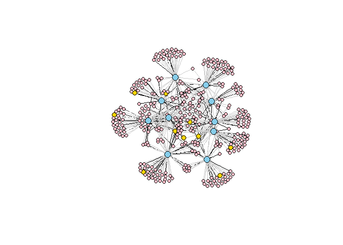
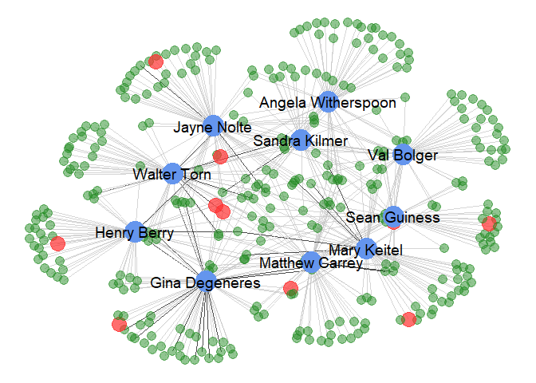

Network Visualization in R
================

Visualizing Networks using different R packages (igraph, visNetwork, ggnet2)
----------------------------------------------------------------------------

the data is taken from DVD Rental database. consists of three columns: customer name, number of rentals each customer rented for each actor, and top 10 actors names ...

``` r
head(customerActor)
```

    ##     Customer_Name Number_of_Rentals     Actor_Name
    ## 1  Patrick Newsom                 6   Sean Guiness
    ## 2     Julian Vest                 6  Sandra Kilmer
    ## 3 Clifford Bowens                 6     Val Bolger
    ## 4   Juanita Mason                 6 Matthew Carrey
    ## 5  Louise Jenkins                 6    Mary Keitel
    ## 6   Joyce Edwards                 5 Gina Degeneres

we then extract the names of the top fan per actor along with the names of the top 10 actors.

``` r
top10actors <- unique(customerActor$Actor_Name) 
### data is already sorted descreasingly
topCustomerPerActor <- 
  customerActor[!duplicated(customerActor$Actor_Name), ]
names(topCustomerPerActor)[1] <- "Top_Fan"
topFans <- topCustomerPerActor$Top_Fan
head(topCustomerPerActor)
```

    ##           Top_Fan Number_of_Rentals     Actor_Name
    ## 1  Patrick Newsom                 6   Sean Guiness
    ## 2     Julian Vest                 6  Sandra Kilmer
    ## 3 Clifford Bowens                 6     Val Bolger
    ## 4   Juanita Mason                 6 Matthew Carrey
    ## 5  Louise Jenkins                 6    Mary Keitel
    ## 6   Joyce Edwards                 5 Gina Degeneres

Visualizing the network of the actors and their fans using:
-----------------------------------------------------------

IGRAPH and visNetwork
---------------------

first we import the igraph package

``` r
library(igraph)
#first we trim the data to show only customers who rented more than twice 
cust <- customerActor[customerActor$Number_of_Rentals > 2, ]
# creating the nodes of the graph from data.frame 
graph <- graph_from_data_frame(cust[, c(1, 3)])
# edge weights according to number of rentals
E(graph)$weight <- cust[, 2]
# assigning node type
V(graph)$who <- ifelse(V(graph)$name %in% top10actors, 'superstar',
                       ifelse(V(graph)$name %in% topFans, 'top_fan', 
                              'fan'))
# node colors, size and label
V(graph)$color <- c('pink', 'skyblue', 'gold')[factor(V(graph)$who)]
V(graph)$size <- c(5, 10, 7.5)[factor(V(graph)$who)]
V(graph)$label.color <- "black"
V(graph)$label <- NA
# edge color based on weights
E(graph)$color <- ifelse(E(graph)$weight >= 4, 'black', 'grey80')
E(graph)$arrow.size = 0.1
#plotting the graph
plot(graph)
```



the graph isn't the best one but we can play with node colors, size and edge width etc. to get better result.

we then can visualize the graph using visNetwork package N.B. the node sizes and colors we assigned in igraph will affect the layout of the visNetwork. we have two ways: first, to convert the igraph to visNetwork

``` r
library(visNetwork)
data <- toVisNetworkData(graph)
# visNetwork(nodes = data$nodes, edges = data$edges, 
#     height = "500px") %>%
#   visIgraphLayout()

# or visualizing it directly:

# visIgraph(graph)
```

visualizing the network using ggnet2.
-------------------------------------

we first convert the data frame to an incidence matrix

``` r
cus <- spread(cust, Actor_Name, Number_of_Rentals)
row.names(cus) <- cus$Customer_Name
cus <- cus[, -1]
cus[is.na(cus)] <- 0
```

then we import the packages and create our bipartite network class.

``` r
library(GGally)
library(sna)
library(network)
library(ggplot2)
library(tidyr)
library(dplyr)

net <- network(cus ,
               matrix.type = "bipartite",
               ignore.eval = FALSE,
               names.eval = "weights")
```

then we create network attributes.

``` r
## node type
net %v% "superstar" = ifelse(
  network.vertex.names(net) %in% top10actors, "actor",
  ifelse(
    network.vertex.names(net) %in% topFans, "topFan", "fan")
)
## node color
net %v% "color" = ifelse(
  net %v% "superstar" == "actor", "cornflowerblue",
  ifelse(
    net %v% "superstar" == "topFan", "firebrick1", "forestgreen")
)
## edge colors
net %e% "coloring" = ifelse(
  net %e% "weights" > 4, "black", "grey77")
```

then we visualize the network.

``` r
ggnet2(net, label = top10actors, color = "color", 
       label.color = "black", label.size = 5,
       alpha = "superstar", alpha.palette = c(
         "actor" = 1, "fan" = 0.5, "topFan" = 0.7),
       size = "superstar", size.palette = c(
         "actor" = 5, "fan" = 1, "topFan" = 2.5),
       edge.color = "coloring", edge.alpha = 0.7) +
  guides(alpha = FALSE, size = FALSE)
```


